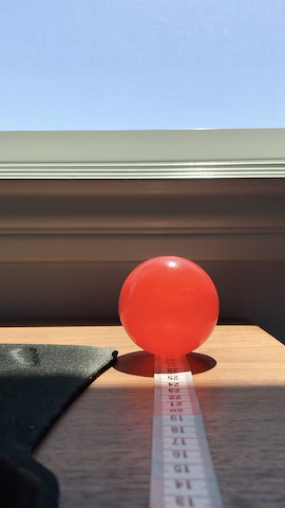
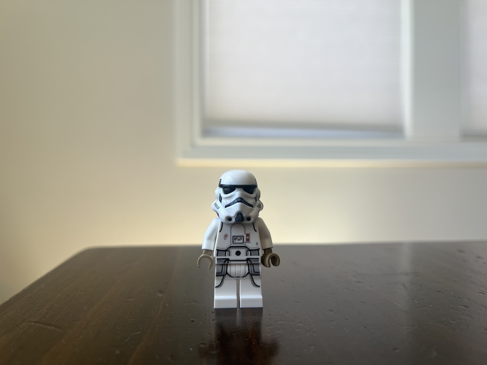

# Lab 3.3 Single View Measurements

In this lab you will experiment with ways of measuring properties of your camera and objects in the scene from a single image.

You can use this [measurement tool](https://colab.research.google.com/github/calpoly-csc4888/CSC-4888-Labs/blob/main/Notebooks/Measurement_Tool.ipynb) to make measurements in your images.

1. **Measuring focal length from an object** 

    i. Choose an object measure its physical size.
    ii. Place the object in front of your camera and measure the distance from the object to the camera.  
    iii. Measure the size of the object in the image (in pixels).
    iv. From these measurements, determine the focal length of the camera.  Compare with the focal length you estimated in Lab 3.1.

    Here's an example image that I captured of our favorite red ball, with my camera resting on the desk:

    

2. **Measuring the height of an object**

    i. This time, put your phone upright on the desk and again take a picture of an object, making sure that the camera is not tilted up or down.
    ii. Measure the height of the camera off of the desk.
    iii. Measure the size of the object in the image (in pixels) and the y-coordinate where it touches the desk.
    iv. Making use of these measurements and your focal length estimate from before, estimate both the distance to the object and the height of the object.  Compare to physical measurements of the distance and object size.

    Here's my example image for this one:

    